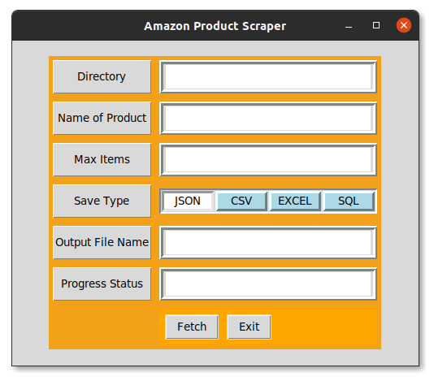
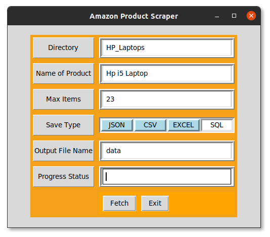
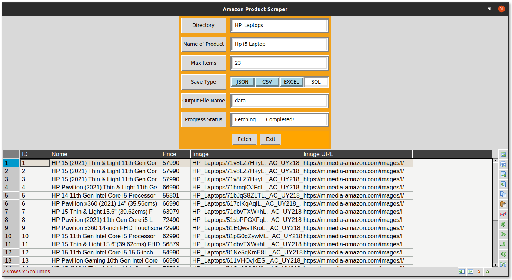
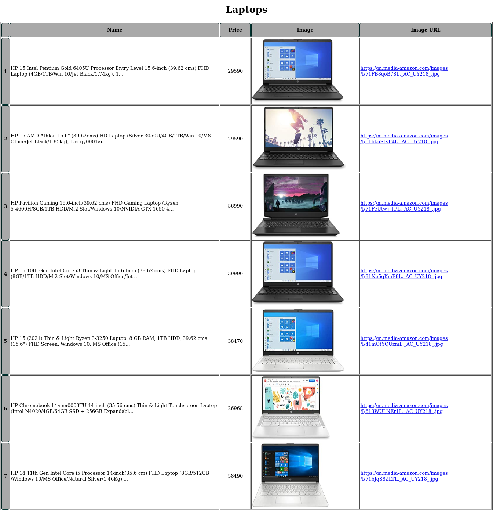

# Amazon-Product-Scraper-Using-Python
It take data from amazon website using web scraping and after that give output in different format like : json , excel , csv, html , sql

Simple Amazon Product Scraper will give details of products in diffrent format of data like JSON,SQL Script,CSV and Excel.
## Types of Output
1. JSON
2. CSV
3. EXCEL
4. SQL
5. HTML

## How to Run?
```bash
python3 install -r requiremnet.txt
python3 code.py
```







# JSON Output:

```json
{
  "ID": {
    "1": 1,
    "2": 2,
    "3": 3,
    "4": 4,
    "5": 5,
    "6": 6,
    "7": 7,
    "8": 8,
    "9": 9,
    "10": 10,
    "11": 11,
    "12": 12,
    "13": 13
  },
  "Name": {
    "1": "ASUS VivoBook 15 (2020), 39.6 cm HD, Dual Core Intel Celeron N4020, Thin and Light Laptop (4GB RAM/256GB SSD/Integrated Gr...",
    "2": "ASUS VivoBook 15 (2020), 39.6 cm HD, Dual Core Intel Celeron N4020, Thin and Light Laptop (4GB RAM/256GB SSD/Integrated Gr...",
    "3": "ASUS VivoBook 15 (2020), 39.6 cm HD, Dual Core Intel Celeron N4020, Thin and Light Laptop (4GB RAM/256GB SSD/Integrated Gr...",
    "4": "HP 15 AMD Athlon 15.6\" (39.62cms) HD Laptop (Silver-3050U/4GB/1TB/Win 10/MS Office/Jet Black/1.85kg), 15s-gy0001au",
    "5": "Lenovo Ideapad S145 AMD RYZEN 3 3200U 15.6-inch (39.62 cms) FHD Laptop (4GB/1TB/Windows 10/Office 2019/Grey/1.85Kg),81UT00...",
    "6": "HP 15 Intel Pentium Gold 6405U Processor Entry Level 15.6-inch (39.62 cms) FHD Laptop (4GB/1TB/Win 10/Jet Black/1.74kg), 1...",
    "7": "Avita Essential Refresh NE14A2INC43A-MB 14-inch/35.56 cm(Intel Celeron-N4020/4GB/128GB SSD/Windows 10 Home/FHD/Integrated ...",
    "8": "Lenovo V15 AMD 15.6-inch FHD Thin and Light Laptop (AMD Athlon Silver 3050 U/ 4GB RAM/ 1TB HDD/ Windows 10 Home/Integrated...",
    "9": "Avita Essential Refresh NE14A2INC43A-CR 14-inch/35.56 cm(Intel Celeron-N4020/4GB/128GB SSD/Windows 10 Home/FHD/Integrated ...",
    "10": "Lenovo Ideapad Slim 3 Intel Celeron N4020 15.6\" (39.62cms) HD Thin and Light Laptop (4GB/256SSD/Win10/Intel UHD Graphics 6...",
    "11": "(Renewed) Fujitsu Intel Core i5 3340M 15.6-Inch (39.62 cms) 1366 X 768 Laptop (4 GB/320 GB HDD/Windows/Intel HD Graphics/B...",
    "12": "AVITA Essential NE14A2INC433-MB 14\" (35.56cms) Laptop (Celeron N4000/4GB/128GB SSD/Window 10 Home in S Mode/Integrated Gra...",
    "13": "(Renewed) AVITA Essential Intel Celeron 14-Inch (35.56 cms) 1920x1080 Laptop (4 GB/128 GB SSD/Window 10 Home in S mode/Int..."
  },
  "Price": {
    "1": "22,990",
    "2": "22,990",
    "3": "22,990",
    "4": "27,999",
    "5": "31,975",
    "6": "27,990",
    "7": "18,990",
    "8": "25,990",
    "9": "18,990",
    "10": "27,490",
    "11": "19,990",
    "12": "18,990",
    "13": "15,192"
  },
  "Image": {
    "1": "Laptops/81IgKPn5qlL._AC_UY218_.jpg",
    "2": "Laptops/81IgKPn5qlL._AC_UY218_.jpg",
    "3": "Laptops/81IgKPn5qlL._AC_UY218_.jpg",
    "4": "Laptops/61bkuSlKF4L._AC_UY218_.jpg",
    "5": "Laptops/811w2pSQcnL._AC_UY218_.jpg",
    "6": "Laptops/71FB8qoB78L._AC_UY218_.jpg",
    "7": "Laptops/61YdFkoR9dL._AC_UY218_.jpg",
    "8": "Laptops/71vCx6vbdBL._AC_UY218_.jpg",
    "9": "Laptops/61NsZ6UrfPL._AC_UY218_.jpg",
    "10": "Laptops/61Dw5Z8LzJL._AC_UY218_.jpg",
    "11": "Laptops/61J5eB-TdyL._AC_UY218_.jpg",
    "12": "Laptops/61YdFkoR9dL._AC_UY218_.jpg",
    "13": "Laptops/61cZP7xgLaL._AC_UY218_.jpg"
  },
  "Image URL": {
    "1": "https://m.media-amazon.com/images/I/81IgKPn5qlL._AC_UY218_.jpg",
    "2": "https://m.media-amazon.com/images/I/81IgKPn5qlL._AC_UY218_.jpg",
    "3": "https://m.media-amazon.com/images/I/81IgKPn5qlL._AC_UY218_.jpg",
    "4": "https://m.media-amazon.com/images/I/61bkuSlKF4L._AC_UY218_.jpg",
    "5": "https://m.media-amazon.com/images/I/811w2pSQcnL._AC_UY218_.jpg",
    "6": "https://m.media-amazon.com/images/I/71FB8qoB78L._AC_UY218_.jpg",
    "7": "https://m.media-amazon.com/images/I/61YdFkoR9dL._AC_UY218_.jpg",
    "8": "https://m.media-amazon.com/images/I/71vCx6vbdBL._AC_UY218_.jpg",
    "9": "https://m.media-amazon.com/images/I/61NsZ6UrfPL._AC_UY218_.jpg",
    "10": "https://m.media-amazon.com/images/I/61Dw5Z8LzJL._AC_UY218_.jpg",
    "11": "https://m.media-amazon.com/images/I/61J5eB-TdyL._AC_UY218_.jpg",
    "12": "https://m.media-amazon.com/images/I/61YdFkoR9dL._AC_UY218_.jpg",
    "13": "https://m.media-amazon.com/images/I/61cZP7xgLaL._AC_UY218_.jpg"
  }
}

```

# SQL Output:
~~~~sql
CREATE TABLE "LaptopTable" (
"index" INTEGER,
  "ID" INTEGER,
  "Name" TEXT,
  "Price" TEXT,
  "Image" TEXT,
  "Image URL" TEXT
)

INSERT INTO LaptopTable (ID, Name, Price, Image, Image URL) VALUES (1, 'ASUS VivoBook 15 (2020), 39.6 cm HD, Dual Core Intel Celeron N4020, Thin and Light Laptop (4GB RAM/256GB SSD/Integrated Gr...', '22,990', 'Laptops/81IgKPn5qlL._AC_UY218_.jpg', 'https://m.media-amazon.com/images/I/81IgKPn5qlL._AC_UY218_.jpg')

INSERT INTO LaptopTable (ID, Name, Price, Image, Image URL) VALUES (2, 'ASUS VivoBook 15 (2020), 39.6 cm HD, Dual Core Intel Celeron N4020, Thin and Light Laptop (4GB RAM/256GB SSD/Integrated Gr...', '22,990', 'Laptops/81IgKPn5qlL._AC_UY218_.jpg', 'https://m.media-amazon.com/images/I/81IgKPn5qlL._AC_UY218_.jpg')

INSERT INTO LaptopTable (ID, Name, Price, Image, Image URL) VALUES (3, 'ASUS VivoBook 15 (2020), 39.6 cm HD, Dual Core Intel Celeron N4020, Thin and Light Laptop (4GB RAM/256GB SSD/Integrated Gr...', '22,990', 'Laptops/81IgKPn5qlL._AC_UY218_.jpg', 'https://m.media-amazon.com/images/I/81IgKPn5qlL._AC_UY218_.jpg')

INSERT INTO LaptopTable (ID, Name, Price, Image, Image URL) VALUES (4, 'HP 15 AMD Athlon 15.6" (39.62cms) HD Laptop (Silver-3050U/4GB/1TB/Win 10/MS Office/Jet Black/1.85kg), 15s-gy0001au', '27,999', 'Laptops/61bkuSlKF4L._AC_UY218_.jpg', 'https://m.media-amazon.com/images/I/61bkuSlKF4L._AC_UY218_.jpg')

INSERT INTO LaptopTable (ID, Name, Price, Image, Image URL) VALUES (5, 'HP 15 Intel Pentium Gold 6405U Processor Entry Level 15.6-inch (39.62 cms) FHD Laptop (4GB/1TB/Win 10/Jet Black/1.74kg), 1...', '27,990', 'Laptops/71FB8qoB78L._AC_UY218_.jpg', 'https://m.media-amazon.com/images/I/71FB8qoB78L._AC_UY218_.jpg')

INSERT INTO LaptopTable (ID, Name, Price, Image, Image URL) VALUES (6, 'Avita Essential Refresh NE14A2INC43A-MB 14-inch/35.56 cm(Intel Celeron-N4020/4GB/128GB SSD/Windows 10 Home/FHD/Integrated ...', '18,990', 'Laptops/61YdFkoR9dL._AC_UY218_.jpg', 'https://m.media-amazon.com/images/I/61YdFkoR9dL._AC_UY218_.jpg')

INSERT INTO LaptopTable (ID, Name, Price, Image, Image URL) VALUES (7, 'Lenovo V15 AMD 15.6-inch FHD Thin and Light Laptop (AMD Athlon Silver 3050 U/ 4GB RAM/ 1TB HDD/ Windows 10 Home/Integrated...', '25,990', 'Laptops/71vCx6vbdBL._AC_UY218_.jpg', 'https://m.media-amazon.com/images/I/71vCx6vbdBL._AC_UY218_.jpg')

INSERT INTO LaptopTable (ID, Name, Price, Image, Image URL) VALUES (8, 'Avita Essential Refresh NE14A2INC43A-CR 14-inch/35.56 cm(Intel Celeron-N4020/4GB/128GB SSD/Windows 10 Home/FHD/Integrated ...', '18,990', 'Laptops/61NsZ6UrfPL._AC_UY218_.jpg', 'https://m.media-amazon.com/images/I/61NsZ6UrfPL._AC_UY218_.jpg')

INSERT INTO LaptopTable (ID, Name, Price, Image, Image URL) VALUES (9, 'Lenovo Ideapad Slim 3 Intel Celeron N4020 15.6" (39.62cms) HD Thin and Light Laptop (4GB/256SSD/Win10/Intel UHD Graphics 6...', '27,490', 'Laptops/61Dw5Z8LzJL._AC_UY218_.jpg', 'https://m.media-amazon.com/images/I/61Dw5Z8LzJL._AC_UY218_.jpg')

INSERT INTO LaptopTable (ID, Name, Price, Image, Image URL) VALUES (10, '(Renewed) Fujitsu Intel Core i5 3340M 15.6-Inch (39.62 cms) 1366 X 768 Laptop (4 GB/320 GB HDD/Windows/Intel HD Graphics/B...', '19,990', 'Laptops/61J5eB-TdyL._AC_UY218_.jpg', 'https://m.media-amazon.com/images/I/61J5eB-TdyL._AC_UY218_.jpg')

INSERT INTO LaptopTable (ID, Name, Price, Image, Image URL) VALUES (11, 'AVITA Essential NE14A2INC433-MB 14" (35.56cms) Laptop (Celeron N4000/4GB/128GB SSD/Window 10 Home in S Mode/Integrated Gra...', '18,990', 'Laptops/61YdFkoR9dL._AC_UY218_.jpg', 'https://m.media-amazon.com/images/I/61YdFkoR9dL._AC_UY218_.jpg')

INSERT INTO LaptopTable (ID, Name, Price, Image, Image URL) VALUES (12, 'Lenovo Ideapad S145 AMD RYZEN 3 3200U 15.6-inch (39.62 cms) FHD Laptop (4GB/1TB/Windows 10/Office 2019/Grey/1.85Kg),81UT00...', '31,980', 'Laptops/811w2pSQcnL._AC_UY218_.jpg', 'https://m.media-amazon.com/images/I/811w2pSQcnL._AC_UY218_.jpg')

INSERT INTO LaptopTable (ID, Name, Price, Image, Image URL) VALUES (13, 'RDP ThinBook 1010 - Intel Celeron Quad Core Processor, 4GB RAM, 64GB Storage, Windows 10 Pro, 14.1” HD Screen', '19,990', 'Laptops/51C6EHkMQpS._AC_UY218_.jpg', 'https://m.media-amazon.com/images/I/51C6EHkMQpS._AC_UY218_.jpg')
~~~~

# HTML


